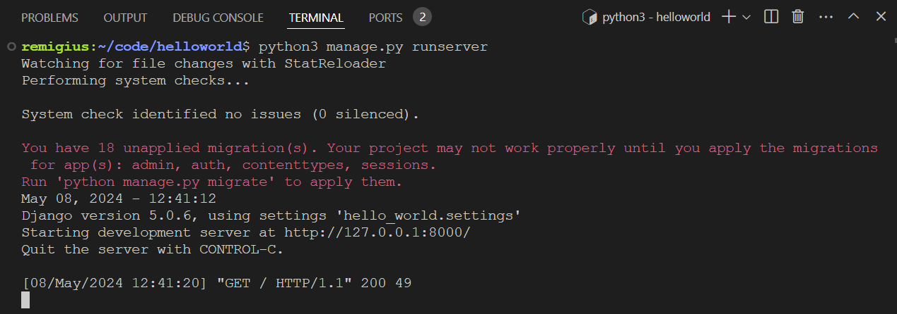
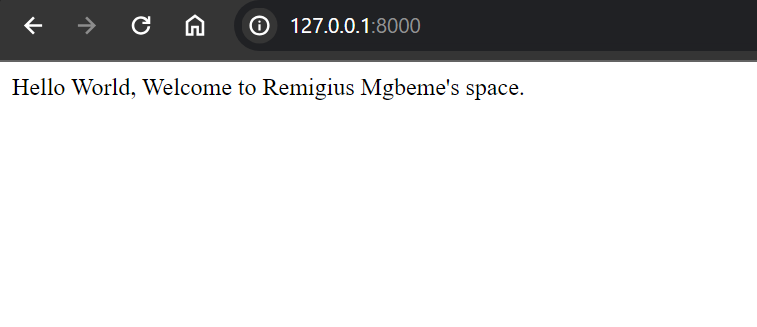

# HELLO WORLD PROJECT

## Introduction
This is a simple project to demonstrate how to use django to print a messgae on the web.

## Installation
1. Clone the repository.
2. Install dependencies with 'pip install -r requirements.txt'.

## Usage
1. Run 'python manage.py runserver' to start the application.
2. Visit 'http://localhost:8000' in your web browser to view the application.

## Contributing
1. Fork the repository.
2. Create a new branch ('git checkout -b feature-branch').
3. Make your changes.
4. Commit your changes ('git commit -am 'Add new feature').
5. Push to the branch ('git push origin feature-branch').
6. Create a new Pull Request.

## Images

## License
This project is licensed under the MIT License. See the [LICENSE](LICENSE) file for details.
